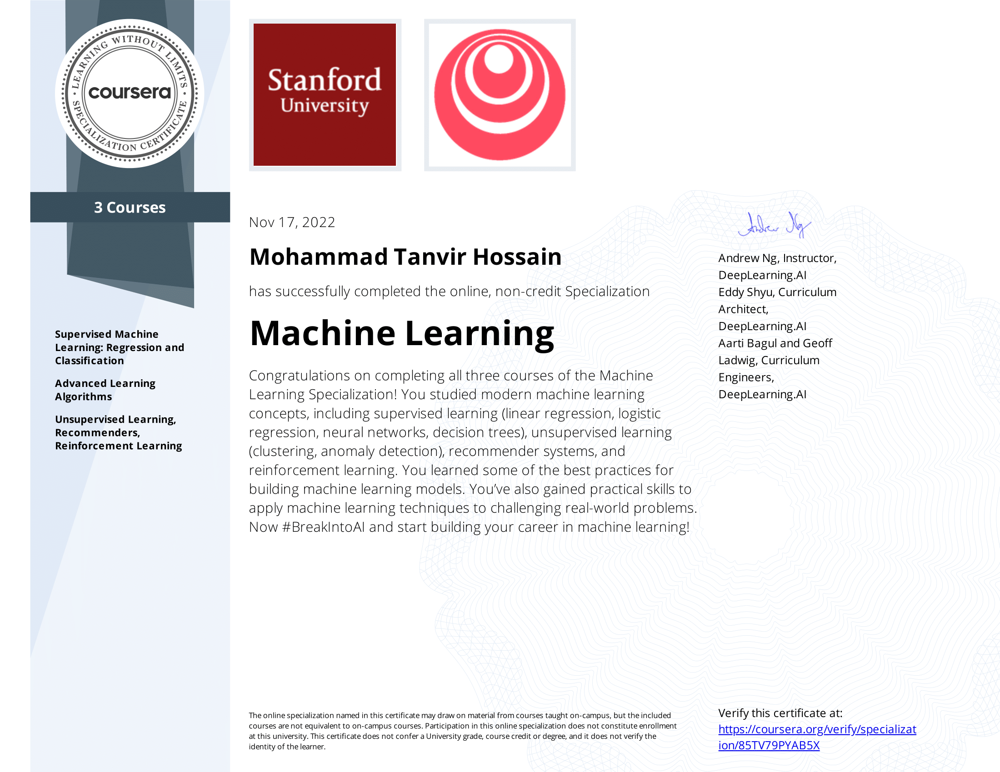

# Machine Learning Specialization

The Machine Learning Specialization is a foundational online program created in collaboration between DeepLearning.AI and Stanford Online. This beginner-friendly program will teach you the fundamentals of machine learning and how to use these techniques to build real-world AI applications. 

This Specialization is taught by Andrew Ng, an AI visionary who has led critical research at Stanford University and groundbreaking work at Google Brain, Baidu, and Landing.AI to advance the AI field.

This 3-course Specialization is an updated version of Andrew’s pioneering Machine Learning course, rated 4.9 out of 5 and taken by over 4.8 million learners since it launched in 2012. 

It provides a broad introduction to modern machine learning, including supervised learning (multiple linear regression, logistic regression, neural networks, and decision trees), unsupervised learning (clustering, dimensionality reduction, recommender systems), and some of the best practices used in Silicon Valley for artificial intelligence and machine learning innovation (evaluating and tuning models, taking a data-centric approach to improving performance, and more.)

By the end of this Specialization, you will have mastered key concepts and gained the practical know-how to quickly and powerfully apply machine learning to challenging real-world problems. If you’re looking to break into AI or build a career in machine learning, the new Machine Learning Specialization is the best place to start.

## SKILLS GAINED THROUGHOUT THIS COURSE

• Build machine learning models in Python using popular machine learning libraries NumPy and scikit-learn.

• Build and train supervised machine learning models for prediction and binary classification tasks, including linear regression and logistic regression.

• Build and train a neural network with TensorFlow to perform multi-class classification.

• Apply best practices for machine learning development so that your models generalize to data and tasks in the real world.

• Build and use decision trees and tree ensemble methods, including random forests and boosted trees.

• Use unsupervised learning techniques for unsupervised learning: including clustering and anomaly detection.

• Build recommender systems with a collaborative filtering approach and a content-based deep learning method.

• Build a deep reinforcement learning model.

## WHAT YOU WILL LEARN
* Build ML models with NumPy & scikit-learn, build & train supervised models for prediction & binary classification tasks (linear, logistic regression)

* Build & train a neural network with TensorFlow to perform multi-class classification, & build & use decision trees & tree ensemble methods

* Apply best practices for ML development & use unsupervised learning techniques for unsupervised learning including clustering & anomaly detection

* Build recommender systems with a collaborative filtering approach & a content-based deep learning method & build a deep reinforcement learning model

## 📙 Courses In Specilialization & certificates 

[__Machine Learning__]
(https://github.com/tanvir1985/Machine_Learning_specialization_Andrew_Ng/blob/main/Certificate.png)

- [x] [__Supervised Machine Learning: Regression and Classification__]
(https://github.com/tanvir1985/Machine_Learning_specialization_Andrew_Ng/blob/main/Coursera%206N84TBAZZPT3-1.png)

- [x] [__Advanced Learning Algorithms__]
(https://github.com/tanvir1985/Machine_Learning_specialization_Andrew_Ng/blob/main/Coursera%20ZJWPLV33KWNR-1.png)

  

&copy; 2022 Mohammad Tanvir Hossain 

- [x] [__Unsupervised Learning, Recommenders, Reinforcement Learning__]
(https://github.com/tanvir1985/Machine_Learning_specialization_Andrew_Ng/blob/main/Coursera%20FWLHLHVETGQN-1.png)

  

&copy; 2022 Mohammad Tanvir Hossain 

